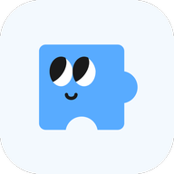

# Lifepuzzle: Storytelling & Memory-Preservation App

**Period**: 2022 – Present (Side Project)  
**Role**: Founder / Tech Lead (Planning, Team Management, Backend & Frontend Setup, Mentoring)  
**Team**: 1 Designer, 2–3 Backend Engineers, 2 Frontend Engineers

## 📌 Challenge
We started Lifepuzzle to help people who struggle with technology — beginning with **grandparents**.  
South Korea has one of the highest elderly poverty rates in the world, and we wanted to create a product where grandchildren could **preserve their grandparents’ stories**, share memories, and strengthen family connections.

The challenge was to design a product that:
- Makes it easy to **organize photos by age group**
- Allows **adding voice and stories** to each photo
- Provides **AI-powered storytelling features** to make memories come alive
- Supports **sharing with family members and external platforms**

## ⚙️ Approach

### Product Design & Iteration
- Initially focused on **story writing**, but user testing revealed it required too much effort.
- Pivoted to a **photo-first experience**, with story-writing as a supportive feature.
- Learned the importance of **rapid prototyping** — too much discussion without prototypes delayed progress early on.

### Key Features
- **Photo-based storytelling**: create protagonists and organize photos by life stage.
- **Voice & story annotations**: attach audio and text narratives to photos.
- **AI Photo (LivePortrait)**: animate photos; currently limited by ARM-based infra.
- **Sharing**: import from Facebook, share externally, and receive stories/photos from others.
- **Slideshow (planned)**: present memories in chronological order.

### Tech Stack
- **Frontend**: React Native (TypeScript)
- **Backend**: Spring Boot (Java), lifepuzzle-api
- **Image Resizer**: Golang microservice
- **Infra**: Initially AWS → migrated to **Mac Mini Kubernetes (minikube)** for cost efficiency
- **Data & Messaging**: MySQL, RabbitMQ (chosen for simplicity, lower ops cost, built-in features like Work Queue, Delayed Retry, Dead Letter Queue)

### Team Processes & Leadership
- Recruited designer, backend, and frontend developers; onboarded juniors.
- Established **code review process** — started too strict, then improved speed with **SHIP, SHOW, ASK** strategy (focus reviews only where needed).
- Set up **documentation practices** (ADR for direction, Tech Specs for design, Work Journey for notes).
- Adopted **story points, sprint-based development**, and maintained **JIRA workflow**.
- Conducted **1:1s monthly** and **team retrospectives bi-monthly** to support personal growth and project alignment.

## 🚀 Results & Current State
- Currently in **beta phase**; internal testing ongoing.
- Pivot to **photo-first storytelling** made the app far more engaging and lightweight for users.
- Shipped Android & iOS apps:
    - [Android Play Store](https://play.google.com/store/apps/details?id=io.itmca.lifepuzzle)
    - [iOS App Store](https://apps.apple.com/kr/app/%EC%9D%B8%EC%83%9D%ED%8D%BC%EC%A6%90/id6443452557)
- AI functionality (LivePortrait) is limited by current infra, but **roadmap includes CUDA-based models** with advanced motion features once subscription & payment systems are added.

## 📖 Lessons Learned

### Team & Leadership
- **1:1 coaching** and resume/interview mentoring helped junior developers grow — some successfully landed roles at strong companies.
- **Retrospectives** after major events were essential to keep improving.

### Process & Management
- Even in side projects, **structured processes** (sprints, story points) significantly improve progress.
- **Rapid prototyping > long discussions** — shipping fast clarified what really mattered to users.

### Technical
- **AI integration** is powerful, but must be combined with thoughtful UX (photos + stories, not AI alone).
- **RabbitMQ** proved to be the right choice over Kafka for a lean team, balancing functionality and operational simplicity.
- **SHIP, SHOW, ASK review model** boosted delivery speed by ~10x compared to strict reviews.

### Personal Growth
- Learned the value of **finding experts** (designer) rather than trying to do everything.
- Understood that **financial sustainability** is crucial for long-term side projects.
- Strengthened ability to **set up technical foundations** (infra, docs, processes) and mentor others while driving a project toward real users.

## 👥 Collaboration
- Led a cross-functional team (designer, BE, FE engineers) as **Founder/Tech Lead**.
- Took ownership of planning, recruiting, mentoring, and establishing technical & organizational culture.
- Balanced management duties with **hands-on contributions** in backend setup, API design, and frontend support.

---
✨ Lifepuzzle is more than a side project — it’s an attempt to **preserve family memories through technology**, combining AI, thoughtful UX, and sustainable processes to create a product that genuinely helps people.