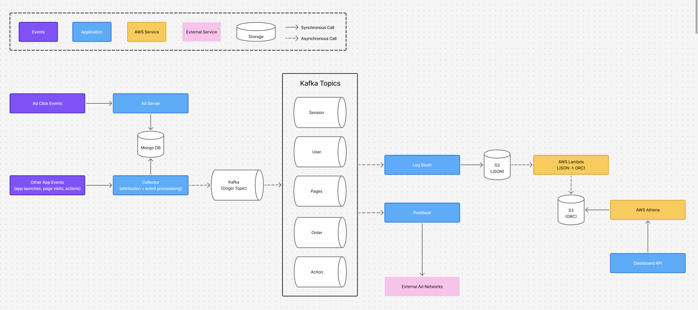

# High-Throughput Data Pipeline with Kafka & Spring Boot at Wisetracker

**Period**: 2018–2021 (Wisetracker, Full-Stack Engineer)  
**Scale**: 2000+ TPS (app events: app launches, page views, actions, ad clicks)  
**Tech Stack**: Java 11, Spring Boot, Kafka, MongoDB (Sharding), MySQL, AWS Lambda, Logstash, S3, ORC, Athena, Microservices (Ad-Server, Collector, Postback, Dashboard-API)

## 📌 Challenge
Wisetracker’s **monolithic system could not keep up with rapidly growing app events**.  

As event volume surged (ad clicks, app launches, page views, user actions), the system encountered **bottlenecks** and growing **operational complexity**. The challenge was to design a **scalable, high-throughput data pipeline** with the goal of handling several thousand TPS, while enabling **flexible analytics** and **fault tolerance**.

## ⚙️ Approach

### 1. Microservices Split
- **Ad-Server**: Dedicated to processing ad click events, storing raw data in MongoDB for efficient retrieval.
- **Collector**: Managed all other app events (launches, page views, actions) directly; applied attribution logic using MongoDB tables and internal modules; published raw event data to Kafka.
- **Postback**: Delivered attribution results to external ad networks.
- **Dashboard-API**: Served aggregated event and attribution data for customer-facing analytics.

### 2. Event Streaming with Kafka
- Raw events from Collector were published to Kafka’s **ORIGIN** topic.
- Kafka pipelines enriched and split data into specialized topics:
    - **SESSION**: Session-level tracking
    - **USER**: Cross-session user identifiers
    - **PAGES**: Detailed page visit and navigation path data with historical context
    - **ORDER**: Purchase events
    - **ACTION**: Other user interactions

### 3. Data Storage & Analytics
- Data streamed from Kafka to Logstash and stored in S3 in JSON format.
- AWS Lambda functions converted JSON data into **ORC** format for efficient storage and querying.
- **Athena** was used to run fast, cost-effective SQL queries on ORC data stored in S3, enabling flexible and low-latency analytics.

## 📊 Architecture Diagram

## 🚀 Results
- Achieved stable processing of **2000+ TPS** across diverse app event types in production.
- Reduced query latency significantly by adopting **ORC** storage format combined with **Athena** for analytics.
- Overcame scaling challenges including memory leaks and MongoDB sharding complexities.
- Successfully migrated from a monolithic architecture to specialized microservices with clear service ownership and improved fault tolerance.

## 🔧 Lessons Learned
- Gained extensive hands-on experience operating and developing microservices with **Kafka, MongoDB (sharding), MySQL, Spring Boot, and AWS Lambda**.
- Learned that effective incident handling requires not only recovery but also robust data correction and reconciliation processes.
- Proactively embedding diagnostic logs greatly accelerated debugging and data backfilling efforts.
- Designed and maintained asynchronous, high-volume data pipelines resilient enough to handle production-scale traffic reliably.

## 👥 Collaboration & Culture
- Collaborated closely with the **CTO** and **2 senior engineers**.
- Contributed across backend and infrastructure domains as a core team member.
- Led initiatives to introduce **Java 11 features** into production and promoted best practices through workshops on **testing** and **clean code** culture.

---
✨ This project was a turning point in my career — it gave me the opportunity to build and operate a scalable, fault-tolerant data pipeline while learning how to transform a system and a team culture to handle large-scale, real-world traffic.