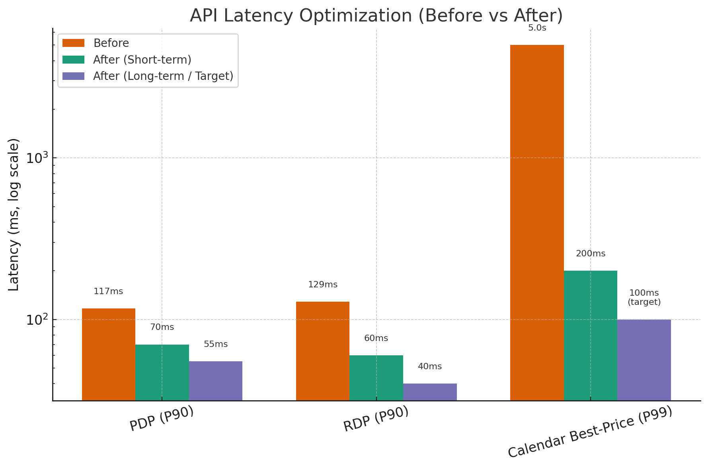

# API Latency Improvement at Yanolja

## Overview
As a Backend Engineer at **Yanolja**, I led latency optimization efforts for key APIs powering the Product Detail Page (PDP) and Room Detail Page (RDP).  
By defining clear latency targets (P90/P99), redesigning query flows, and introducing efficient retrieval strategies, I reduced API response times significantly and established a latency management framework adopted company-wide.

## Background
- **Challenge**: Core APIs suffered from inconsistent performance, especially in high-traffic hotels, with P99 latency reaching **5s** in worst cases.
- **Goal**: Define latency metrics (P90/P99), set short- and long-term targets, and optimize API flows to meet strict UX requirements.
- **Collaboration**: Worked with fellow backend engineers and reviewers, closely coordinating with FE and product teams.

## My Role
- **Backend Engineer** responsible for latency improvements on PDP and RDP APIs.
- Defined latency goals, analyzed bottlenecks, and implemented optimized query flows.
- Spread best practices and introduced a latency management framework to other teams.

## Approach & Solution
1. **Defining Latency Metrics**
    - Selected **P90** as the primary metric:
        - Less affected by uncontrollable outliers (e.g., network spikes)
        - Still representative of the **majority of user experience**
    - Used **P99** for analyzing worst-case scenarios.
    - Latency targets set by comparing **current backend latency** with **client (FE) requirements**, aligned to UX metrics such as:
        - **FCP (First Contentful Paint)** → 1.8s considered “good,” leaving room for backend responses
        - **FID (First Input Delay)** → 100ms target, requiring backend APIs for interactive actions (e.g., “Add to Cart”) to be especially fast

2. **API Flow Optimization**
    - Mapped existing retrieval steps, identified redundant queries, and designed an **ideal query flow**.
    - Combined multiple lookups into **single optimized queries** using projections for required fields only.
    - Improved concurrency by restructuring API calls to be fetched in parallel where possible.

3. **Case Study: Calendar Best-Price API**
    - Problem: For hotels with large datasets, best-price-by-date queries caused **P99 = 5s latency**.
    - Solution: Eliminated unnecessary retrieval steps, replaced multiple queries with a single optimized query, and applied projection.
    - Result: Reduced P99 from **5s → 200ms**.

4. **Cross-team Collaboration**
    - Worked with FE teams to align backend latency targets with **FCP/FID UX requirements**.
    - Example: “Add to Cart” API showed **P90 = 200ms**, exceeding FID targets; requested and supported latency improvements by the commerce team.
    - Shared methodology and Redash queries for latency tracking, enabling other teams to adopt systematic performance management.

## Results & Impact

- **PDP API**: Reduced P90 latency from **117ms → 70ms (short-term) → 55ms (long-term, cross-team collaboration)**
- **RDP API**: Reduced P90 latency from **129ms → 60ms (short-term) → 40ms (long-term, cross-team collaboration)**
- **Calendar Best-Price Query**: Reduced P99 latency from **5s → 200ms (short-term achieved)**; long-term target was **100ms (not executed due to cross-team constraints)**
- **Overall Stay API**: Up to **10% latency reduction**, 66% throughput improvement after connection pooling
- **Business Impact**: Faster page load on PDP/RDP improved user satisfaction and reduced abandonment rates
- **Organizational Impact**: Latency metric framework enabled other teams to systematically manage and improve their APIs

## Key Learnings
- Selecting **P90** as the main metric balanced stability and representativeness, while **P99** served as a useful tool for investigating extreme cases.
- Aligning backend targets with **frontend UX metrics (FCP, FID)** ensured meaningful improvements for real user experiences.
- Visualizing API flows, beyond just inspecting code, made it easier to identify optimization opportunities.
- Proactively sharing methodology across teams multiplied the overall impact of the improvements. 