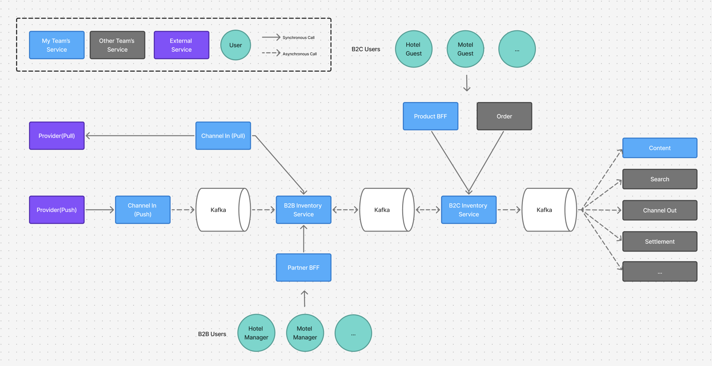
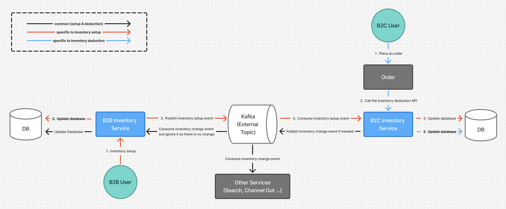
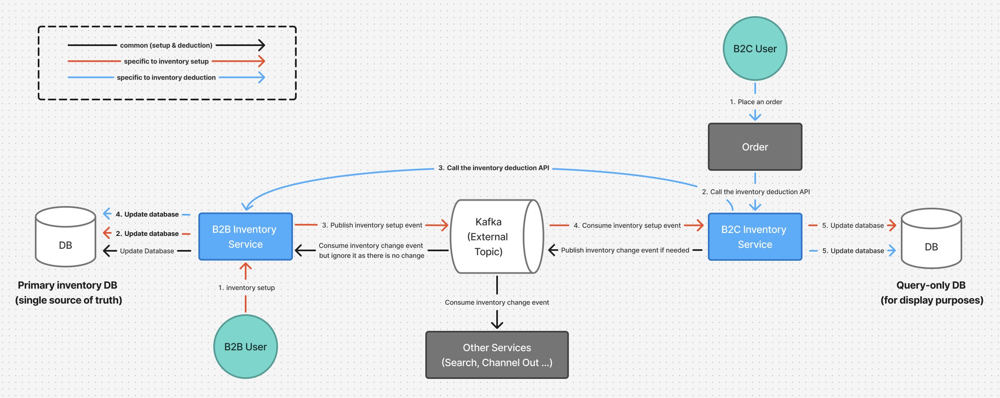

# Unified Inventory Logic; Prevented Overbooking

## Context
At Yanolja, inventory management was split between **B2B** and **B2C** systems:
- **B2B** handled inventory setup.
- **B2C** handled inventory deduction and restoration during booking and cancellation.

These two systems communicated asynchronously via Kafka, which led to:
- Overbooking issues caused by duplicate updates across services.
- Slower feature development, since changes required work on both sides.
- Higher overall system complexity, leading to more maintenance overhead and slower product iterations.

## Overall Architecture

**Key points**
- Separate B2B and B2C inventory services.
- Kafka used for synchronization.
- Both systems maintained their own DBs.

In this architecture, no single system owned the inventory state, which created eventual consistency risks and frequent coordination overhead.

## Before (Legacy Flow)

**Problems**
- **Duplicate DB updates**: both B2B and B2C updated databases separately.
- **Complex event flows**: setup and deduction logic intertwined.
- **Inconsistent source of truth**: no single owner for inventory state.
- **Risk of overbooking** due to eventual consistency issues.

## After (Unified Flow)

**Solution**
- Migrated **deduction/restoration logic** into B2B inventory service.
- B2C acts as a **proxy** and keeps a lightweight DB **only for query/display purposes**.
- Established B2B DB as the **single source of truth**.
- Simplified event flows through Kafka.

## My Role
- **Led the project** end-to-end with 3 engineers (myself as lead, 1 senior, 1 junior), including effort estimation and stakeholder alignment.
- **Defined project scope and effort estimates**, coordinated schedules with Product Owners
- **Designed the new deduction/restoration flow**, consolidating logic into B2B side while B2C acted as a proxy
- **Wrote detailed test cases** (dozens of edge cases across transaction, bundle, membership, discounts, etc.)
- **Facilitated review sessions** and ensured safe migration with feature flags and staged rollout
- **Reviewed all code**, mentored the junior developer, and guided the team through implementation.

## Key Decisions
1. **Unify deduction/restoration in B2B service**
    - B2B becomes the source of truth for inventory
    - B2C proxies requests and continues distributing inventory info to B2C services

2. **Design a generalized 3-step flow**
    - Pre-deduction (validate availability, handle room-level inventory)
    - Deduction (update reservable quantity)
    - Post-deduction (propagate events, alerts, related inventory changes) → simplified logic across product types and made the system easier to extend.

3. **Migration without disruption**
    - Feature flags to toggle new logic
    - Gradual rollout: start with 1 property → 10 → 100+
    - Comprehensive regression test suite

## Results
- **Eliminated overbooking issues** in production (reduced incidents to zero)
- **Reduced overall system complexity** — feature teams no longer needed to update both B2B and B2C logic
- **Accelerated feature development**
    - Room-level inventory sharing completed **30% faster** (2 months → 1.5 months)
    - Subsequent inventory-related projects achieved even greater timeline reductions
- **Improved team’s shared understanding** of inventory domain
- **Reduced coordination overhead** between B2B and B2C teams, freeing up engineering capacity for new features.